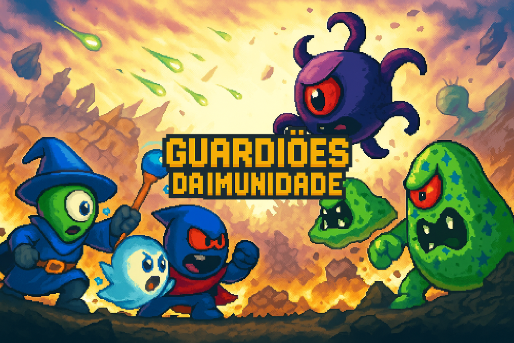

# 🚀 Projeto Integrador – Guardiões da Imunidade

  

## :scroll: História

Dentro de um vasto universo microscópico, **uma guerra silenciosa acontece a cada instante**. De um lado, as **células de defesa** atuam como guardiãs incansáveis, sempre em alerta para proteger o organismo contra qualquer ameaça. Cada uma cumpre sua função essencial, patrulhando como sentinelas e usando seu poder para manter o corpo em equilíbrio.

Do outro lado, **microrganismos invasores** elaboram novas estratégias para romper as barreiras naturais e conquistar território. Rápidos e numerosos, tentam transformar o corpo em seu novo lar, espalhando infecção por onde passam.

Mas um novo perigo surge: **um vírus desconhecido**, mais poderoso, inteligente e adaptável do que todos os anteriores. Capaz de multiplicar-se rapidamente e até fortalecer outros vírus, **ele desencadeia um caos crescente** e coloca todo o sistema imunológico sob ameaça.

Agora, apenas as **células protetoras** podem impedir que essa super-ameaça tome controle completo do organismo — **e cabe a você liderá-las nessa batalha pela sobrevivência**.

---

## 📝 Descrição do Projeto  
Este projeto é um jogo 2D desenvolvido em **C** com a biblioteca **Allegro 5**, no estilo **_Tower Defense_**, com o tema do **Sistema Imunológico Humano**. Aprenda de forma divertida e viciante defendendo o corpo humano contra ameaças biológicas.

---

## 🎯 Objetivo  
- Ensinar o funcionamento do sistema imunológico com entretenimento  
- Promover o aprendizado por meio de mecânicas de evolução e estratégia  
- Apresentar informações e curiosidades interessantes ao longo do jogo

 

> **Ciência da Computação** – Centro Universitário Senac
